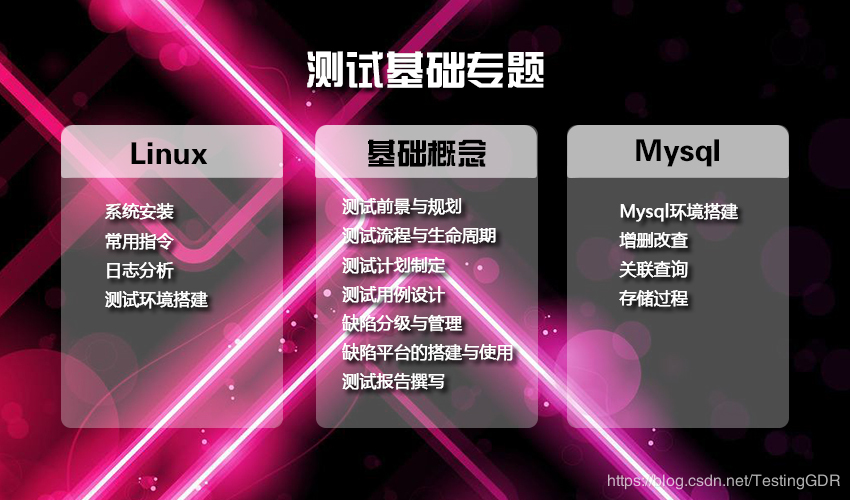

# FusionSphere

## FusionSphere-概念

###  认识FusionSpherer

* 华为公司面向多行业客户推出的云操作系统产品。 
* 专门为云设计和优化。 
  * 提供强大的虚拟化功能和资源池管理。 
  * 丰富的云基础服务组件和工具。 
  * 开放的API接口等。 
* 水平整合数据中心物理和虚拟资源，垂直优化业务平台，让企业云计算更加简捷。

|   | FusionSpherer |
| :---: | :---: |
| 虚拟基础架构层 | FusionComputer CNA |
| 虚拟资源管理层 | FusionComputer VRM |
| 云资源管理层 | FusionManager/FusionSpherer Openstack |

## FusionSpherer-组成构建及分述 

### FusionSpherer构成部件

### FusionComputer计算设备虚拟化：

FusionComputer是建立虚拟化环境用到的必选功能模块。

FusionComputer包含模块及模块间的示意图：

### FusionStorage

* 华为FusionStorage是一款软件定义分布式块存储软件。 
* FusionStorage可以为FusionSphere,VMware和物理数据库环境提供高扩展，高性能，高可靠的块存储服务。可以独立购买和使用，对于构建FusionSphere环境，其是可选功能模块 。 
* FusionStorage包含模块及模块间关系示意 

### FusionNetwork

1. 华为软件定义网络功能模块。
2. FusionNetwork是建立/使用高级网络功能， 灵活配置管理网络功能的组件。对于构建FusionSphere环境， 其是可选功能模块
3. Fusion Network包含模块及模块间关系示意:

### OpenStack模型： 

1. OpenStack模块是实现虚拟化环境的统一模型。
2. OpenStack被引入FusionSphere，实现异构虚拟化环境的同一资源抽象，管理和分配。
3. OpenStack插件化扩展示意图：

图:OpenStack插件化示意图

## FusionSphere-兼容性，规格参数 

### 硬件兼容性包括： 

1. 服务器
2. 存储设备
3. 网络设备
4. I/O设备，如网卡，RAID卡，HBA卡，GPU等。
5. Guest OS，Linux，Windows。

### 软件兼容性主要包括： 

1. FusionSphere应用兼容性列表：

   如数据库软件，中间件，Web服务器软件，Email，HA，备份容灾，安全类软件，企业应用软件等。

2. FusionSpherer OpenStack应用兼容性类别：

   如数据库软件，Web服务器软件，文件服务软件，DNS软件，ICT应用软件等。

### FusionSpherer规格参数： 

## FusionSpherer-三个主要场景及典型部署形式 

### 服务器虚拟化场景： 

图：服务器虚拟化场景

：图：服务器虚拟化典型部署

图：FusionSpherer服务器虚拟化场景典型部署

1. Local FusionManager定位于本地数据中心虚拟化环境接入管理等配置。
2. FusionManager ServiceCenter定位千全局资源管理分配，租户portal和自服务等功能。
3. ManageOne数据中心统一管理软件包含ManageOne ServiceCenter运营中心和ManageOne OperationCenter运维中心。
4. ManageOne ServiceCenter负责企业资源统一运营管理。
5. ManageOne OperationCenter负责企业资源统一运维管理。

### 云数据中心场景： 

图：云数据中心场景

图：云数据中心典型部署场景

### 图：云数据中心典型部署场景 

### NFV场景： 

### 图：FusionSphere NFV场景 

## FusionSphere-灾备方案 

### 华为数据保护—-eBackup产品： 

图：华为数据保护

### 华为业务连续性容灾容BCManager产品: 

### 图：华为业务连续性容灾容BCManager产品  

